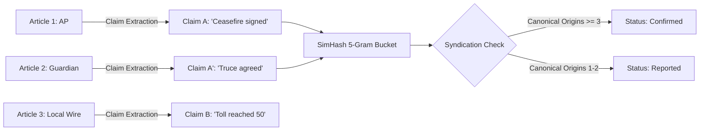
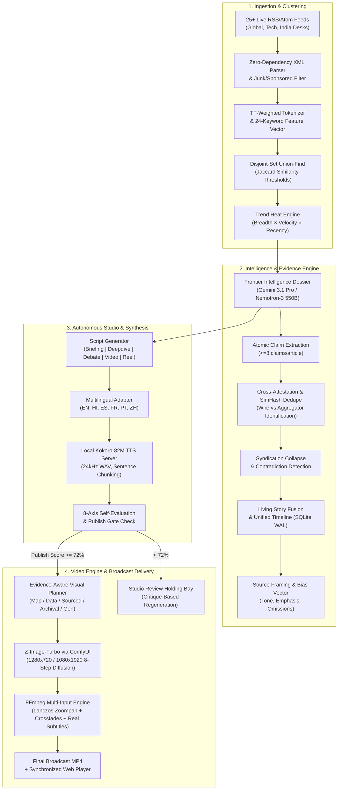
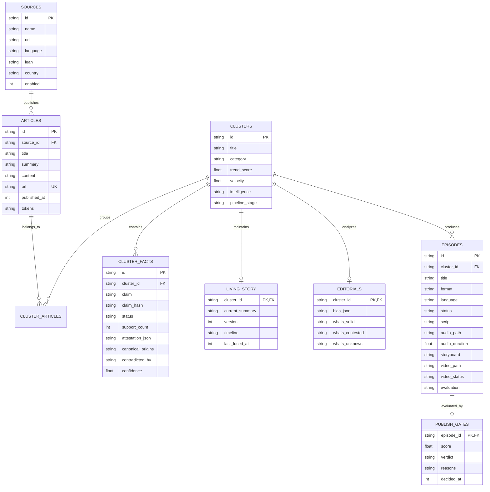
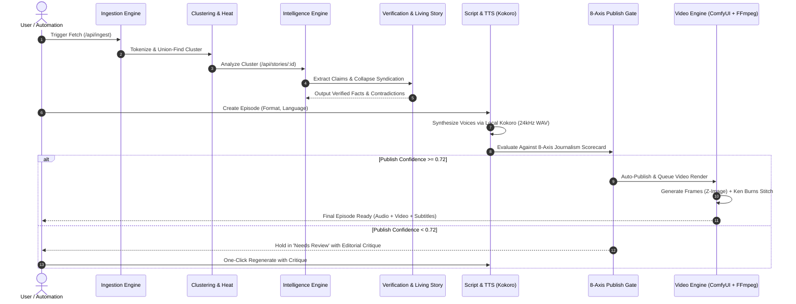

# NEWSCAST AI 🎙️

**An Evidence-Driven Autonomous News Intelligence Engine & Multimedia Production Studio**

> Transforming fragmented, multi-outlet, and conflicting global news into verified intelligence dossiers, evolving living stories, broadcast-ready podcasts, and cinematic documentary videos.

---

```
  ┌──────────────────────────────────────────────────────────────────────────────────┐
  │                                                                                  │
  │   25+ RSS Feeds ──► Token Shingling & Disjoint-Set Clustering ──► Heat Engine    │
  │                                    │                                             │
  │                                    ▼                                             │
  │                    Frontier Intelligence Dossier                                 │
  │            (Gemini 3.1 Pro / Nemotron 3 Ultra 550B / Llama 3.3)                  │
  │                                    │                                             │
  │     ┌──────────────────────────────┼──────────────────────────────┐              │
  │     ▼                              ▼                              ▼              │
  │  Atomic Claims              Living Story Fusion             Multi-Format Script  │
  │  & Cross-Attestation        & Unified Timeline              (En/Hi/Es/Fr/Pt/Zh)  │
  │     │                              │                              │              │
  │     ▼                              │                              ▼              │
  │  Syndication Collapse              │                        Local Kokoro TTS     │
  │  & Contradiction Pairs             │                        (Sub-second Voice)   │
  │     │                              │                              │              │
  │     └──────────────────────────────┼──────────────────────────────┘              │
  │                                    ▼                                             │
  │                   8-Axis Quality Evaluation & Publish Gate                       │
  │                                    │                                             │
  │                     ┌──────────────┴──────────────┐                              │
  │                     ▼ (≥72% Confidence)           ▼ (<72%)                       │
  │              Auto-Publish                   Human Review Holding                 │
  │                     │                       (Critique-Driven Regen)              │
  │                     ▼                                                            │
  │         Visual Plan (Map/Data/Sourced/Archival/Gen)                              │
  │                     │                                                            │
  │                     ▼                                                            │
  │          Z-Image-Turbo (ComfyUI) ──► FFmpeg Ken Burns Engine ──► Broadcast MP4   │
  │                                                                                  │
  └──────────────────────────────────────────────────────────────────────────────────┘
```

---

## Table of Contents

- [Executive Summary](#executive-summary)
- [Key Novelties & Architectural Breakthroughs](#key-novelties--architectural-breakthroughs)
- [System Architecture](#system-architecture)
  - [1. Ingestion, Clustering & Trend Dynamics](#1-ingestion-clustering--trend-dynamics)
  - [2. Verification Layer & Evidence Graph](#2-verification-layer--evidence-graph)
  - [3. Living Story Fusion & Narrative Dissection](#3-living-story-fusion--narrative-dissection)
  - [4. Multilingual Scriptwriting & Voice Synthesis](#4-multilingual-scriptwriting--voice-synthesis)
  - [5. Visual Director & Cinematic Video Engine](#5-visual-director--cinematic-video-engine)
  - [6. Autonomous 8-Axis Editor Gate](#6-autonomous-8-axis-editor-gate)
- [Feature Highlights](#feature-highlights)
- [Technology Stack & Model Topology](#technology-stack--model-topology)
- [Database Schema](#database-schema)
- [Project Layout](#project-layout)
- [Getting Started](#getting-started)
- [API Reference](#api-reference)
- [Production Workflows](#production-workflows)

---

## Executive Summary

Modern digital journalism suffers from three compounding problems: **information fragmentation** (readers must consult a dozen outlets to reconstruct a single event), **syndication echo chambers** (one wire report republished by 20 outlets creates an illusion of 20 independent confirmations), and **editorial bias asymmetry** (different publications strategically foreground or omit critical dimensions of the same story).

**NEWSCAST AI** is a fully autonomous, end-to-end newsroom intelligence platform and multimedia studio that solves these challenges. It ingests 25+ real-time news feeds from global wire services, legacy publishers, independent investigative outlets, tech desks, and regional desks (including a dedicated **India Desk**). It extracts atomic claims, cross-attests evidence, collapses syndication chains, exposes narrative framing differences, and maintains an evolving "living story" timeline for every major global event.

From these verified dossiers, NEWSCAST AI autonomously scripts, voices, evaluates, and renders broadcast-quality podcasts, documentary deep-dives, and vertical video reels in 6 languages—backed by local zero-cost neural TTS and generative diffusion video pipelines.

---

## Key Novelties & Architectural Breakthroughs

### 1. Atomic Evidence Extraction & Cross-Attestation Engine
Instead of summarizing entire articles as monolithic text blocks, the system decomposes each article into **≤8 atomic factual propositions** (who, what, when, where). Claims are fingerprinted using normalized **5-gram SimHash shingles** to cluster semantically equivalent assertions across different publishers without requiring expensive token-heavy pairwise LLM comparisons.



### 2. Syndication Collapse Algorithm
A fundamental flaw in automated aggregation is treating republished wire copy as independent confirmation. NEWSCAST AI implements **Syndication Collapse**:
- Articles originating from canonical wire providers (`AP`, `Reuters`, `AFP`, `BBC`, `DW`) or containing original investigative reporting are tagged as **canonical origins**.
- Downstream publications syndicating or aggregating the same report are cataloged as attestations but **do not increment the independent confirmation count**.
- A claim only achieves `Confirmed` status if corroborated by **3+ independent canonical origins**.

### 3. Bidirectional Opposition-Polarity Contradiction Detection
The verification engine compares claim pairs across overlapping entities and topical keywords. By analyzing affirmative and negative linguistic operators (`denied`, `rejected`, `confirmed`, `vowed`, `retracted`, `disputed`), it identifies mutually incompatible reporting across sources and links them bidirectionally in the evidence graph (`contradicted_by`).

### 4. Self-Evolving "Living Stories" with Idempotent Timeline Fusion
News events unfold over days and weeks. Rather than generating isolated point-in-time updates, NEWSCAST AI maintains a **single canonical narrative** per cluster:
- As new dispatches arrive, the system merges new developments into an integrated 8–12 sentence narrative.
- The chronological event timeline is dynamically extended with verified timestamps while preventing duplicate events.
- **Idempotent caching**: If no new articles have landed since the last fusion pass, the engine skips LLM execution to eliminate token burn.

### 5. Evidence-Aware Visual Director
Generative AI videos frequently fail because visual prompts are either generic or hallucinatory. NEWSCAST AI's visual planner inspects the underlying verified claims for each narration beat and assigns a specialized visual mode:
- 🗺️ **`MAP`**: Top-down cartographic illustrations for geopolitical maneuvers, frontlines, and regional borders.
- 📊 **`DATA`**: Abstract physical infographic structures (monolithic bars, winding trend roads) for economic numbers and casualty statistics.
- 📜 **`SOURCED`**: Macro close-ups of official artifacts, redacted documents, and treaties for policy and legal beats.
- 🏛️ **`ARCHIVAL`**: Press-photography film-grain aesthetics for historical context beats.
- 🎨 **`GENERATED`**: Cinematic editorial news illustrations for environmental and human narrative scenes.

### 6. Autonomous 8-Axis Editor-in-Chief Scorecard & Publish Gate
Every generated episode is evaluated by an autonomous LLM Editor-in-Chief against 8 strict journalistic dimensions before release:

| Evaluation Axis | Weight | Evaluation Criteria |
|:---|:---:|:---|
| **Factual Accuracy** | 30% | Script sentences must directly trace to `confirmed` or `reported` facts in the evidence dossier. |
| **Source Coverage** | 20% | Script quotes diverse canonical origins rather than relying on a single wire. |
| **Contradiction Disclosure** | 15% | Any disputed claims with active contradictions must be explicitly framed as contested on-air. |
| **Syndication Handling** | 10% | Correct attribution (e.g. "a Reuters report picked up by...") without false multi-source claims. |
| **Narrative Clarity** | 10% | Hook within first 2 segments, logical thematic progression, clean sign-off. |
| **Visual Relevance** | 8% | Each storyboard beat's visual prompt strictly mirrors its audio caption. |
| **Audio Quality** | 5% | Natural broadcast cadence, 8–25 words per segment, optimal pause formatting. |
| **Subtitle Sync** | 2% | Segment text length matches expected on-screen reading duration. |

> [!IMPORTANT]
> **The Publish Gate Threshold:** Episodes scoring **≥ 72%** (`publish_confidence >= 0.72`) are automatically published and pushed to the video render queue. Episodes scoring **< 72%** are routed to the **Needs Review** holding area with actionable editorial critiques for one-click regeneration.

---

## System Architecture



---

### Detailed Subsystem Breakdown

#### 1. Ingestion, Clustering & Trend Dynamics
- **Continuous Monitoring:** Scrapes 25+ top-tier global and regional feeds every 45 seconds.
- **Affiliate & Spam Filter:** Regex-based heuristic filters weed out sponsored content, affiliate credit-card listicles, and generic search-engine bait.
- **Clustering:** Runs union-find over normalized token sets. Cross-source stories require a Jaccard overlap of `0.33`, while intra-source articles require `0.42`.
- **Trend Ranking Formula:**
  $$\text{Heat} = (12 \cdot N_{\text{sources}} + 4 \cdot N_{\text{articles}}) \times \max\left(0.2, 1 - \frac{\text{Age}_{\text{hours}}}{\text{Window}_{\text{hours}}}\right)$$
- **Velocity Metrics:** Computes article arrival rate per hour and takes periodic snapshots for live UI sparklines.

#### 2. Verification Layer & Evidence Graph
- **Claim Extraction:** Extracts atomic statements stripped of reporting verbs into structured propositions.
- **SimHash Shingling:** Computes 5-gram rolling hash buckets to group equivalent claims across diverse publications.
- **Confidence Scoring:**
  $$\text{Confidence} = \min\left(0.99, 0.35 \cdot N_{\text{canonical}} + 0.25 \cdot \ln(N_{\text{support}} + 1)\right)$$
- **Contradiction Pairing:** Automatically maps contradictory claims to provide full disclosure of disputed news.

#### 3. Living Story Fusion & Narrative Dissection
- **Integrated Narrative:** Synthesizes incoming updates into an evolving 8–12 sentence narrative.
- **Editorial Bias Analysis:** Analyzes each outlet's coverage to identify charged vocabulary, foregrounded facts, and strategic omissions.
- **Information Gaps:** Identifies consensus facts, contested topics, and "blackout" areas that no media outlet is reporting on.

#### 4. Multilingual Scriptwriting & Voice Synthesis
- **5 Show Formats:**
  1. *Daily Briefing* (90s, 14–18 segments): Rapid, punchy, essential morning update.
  2. *Deep Dive* (3min, 22–30 segments): Authoritative analytical breakdown.
  3. *Two Chairs Debate* (2.5min, 20–26 segments): Conversational chemistry exploring differing perspectives.
  4. *Documentary Video* (10–15min, 90–120 segments): Long-form documentary with a 2-pass continuation engine.
  5. *Vertical Reel* (30–60s, 6–10 segments): High-impact 9:16 vertical hook for social feeds.
- **Native Multilingual Cast:**

| Language | Code | Host Name | Analyst Name | Model / Engine |
|---|:---:|---|---|---|
| **English** | `en` | Heart (`af_heart`) | Adam (`am_adam`) | Kokoro-82M |
| **Hindi** | `hi` | Priya (`hf_alpha`) | Arjun (`hm_omega`) | Kokoro-82M |
| **Spanish** | `es` | Dora (`ef_dora`) | Alex (`em_alex`) | Kokoro-82M |
| **French** | `fr` | Siwis (`ff_siwis`) | Sylvie (`ff_siwis`) | Kokoro-82M |
| **Portuguese** | `pt` | Dora (`pf_dora`) | Alex (`pm_alex`) | Kokoro-82M |
| **Chinese** | `zh` | Xiaobei (`zf_xiaobei`) | Yunxi (`zm_yunxi`) | Kokoro-82M |

- **Local Python Kokoro Server:** Executes Kokoro-82M pipelines on `http://127.0.0.1:8880`. Concurrently concatenates audio buffers and generates 24kHz master WAV files.

#### 5. Visual Director & Cinematic Video Engine
- **Proportional Time Allocation:** Groups script segments into storyboard beats and calculates exact screen times based on word density.
- **Sub-Pixel Ken Burns Motion:** Runs FFmpeg `zoompan` on an oversized $4\times$ canvas ($5120\times2880$ for 16:9, $4320\times7680$ for 9:16) with Lanczos downscaling to eliminate single-pixel frame jitter.
- **Audio-Clock Master Synchronization:** Rescales all beat durations to ensure the video timeline matches the physical audio waveform to the millisecond.
- **Synchronized Overlays:** Renders lower-third caption bands and speaker-color-coded subtitle tracks with support for RTL bidirectional shaping.

```
Story Script ──► Visual Planner ──► Z-Image-Turbo (ComfyUI :8188) ──► data/frames/nc_*.png
                                                                             │
Audio Master Clock (.wav) ──► Proportional Beat Timing (sec)                │
                                       │                                     ▼
                                       └────────────────────────► FFmpeg 4x Zoompan
                                                                             │
                                                                             ▼
[vout] <── Drawtext Subtitles <── Lower-Third Captions <── 0.6s xfade Chain
  │
  └──► libx264 + AAC 160k + faststart ──► public/video/{id}.mp4
```

---

## Feature Highlights

- ⚡ **Real-Time Command Deck (`/`):** Live operational cockpit with real-time news stats, trending stories, audio player, and a personalized "For You" feed.
- 🔥 **Trending Heat Index (`/trending`):** Velocity-ranked global event clusters with sparkline trend histories.
- 🇮🇳 **Dedicated India Desk (`/india`):** Real-time monitoring of Indian national outlets (*The Hindu, NDTV, ThePrint, Scroll, India Today, Times of India, Hindustan Times, Firstpost, The Wire*).
- 📂 **Story Dossier & Verification Lab (`/story/[id]`):** Deep-dive interface with tabs for Intelligence, Source Framing, Living Story Timeline, Multi-Outlet Coverage, and the Claim-Level Evidence Graph.
- 🎛️ **Production Studio (`/studio/[id]`):** Interactive broadcast studio featuring script editors, voice synthesis controls, waveform audio playback, video rendering previews, and the 8-axis Quality Review.
- 📚 **Episode Library (`/library`):** Catalog of all generated shows, playable podcasts, and flagged review items.
- 📊 **Newsroom Telemetry & Analytics (`/analytics`):** Real-time monitoring of LLM token usage, TTS latencies, category coverage mix, and live SSE event streams.
- ⚙️ **Personalization Settings (`/settings`):** Topic affinity tuning and voice preference management.

---

## Technology Stack & Model Topology

### Core Infrastructure
- **Framework:** Next.js 16 (App Router) + React 19 + TypeScript 7
- **Database:** SQLite 3 via `better-sqlite3` with Write-Ahead Logging (WAL) and Foreign Keys enabled
- **Real-Time Transport:** Server-Sent Events (SSE) via in-memory broadcast bus
- **Media Engine:** FFmpeg & FFprobe (native system subprocesses)

### Multi-Tier AI Model Topology

```
┌─────────────────────────────────────────────────────────────────────────────────────────┐
│                                    MODEL TOPOLOGY                                       │
├──────────────────────────────┬─────────────────────────────┬────────────────────────────┤
│ TASK                         │ PRIMARY MODEL               │ FALLBACK / LOCAL           │
├──────────────────────────────┼─────────────────────────────┼────────────────────────────┤
│ Story Intelligence & Dossier │ Gemini 3.1 Pro Preview      │ Nemotron-3 Ultra 550B NIM  │
│ Claim Extraction & Shingling │ Gemini 3.1 Pro / Super 120B │ Llama 3.3 70B Versatile    │
│ Living Story Fusion          │ Gemini 3.1 Pro Preview      │ Nemotron-3 Ultra 550B NIM  │
│ Multilingual Scriptwriting   │ Gemini 3.1 Pro Preview      │ Nemotron-3 Ultra 550B NIM  │
│ 8-Axis Editor-in-Chief Gate  │ Gemini 3.1 Pro Preview      │ Llama 3.3 70B Versatile    │
│ Neural Speech Synthesis      │ Kokoro-82M (Local Server)   │ Groq Orpheus v1 (Cloud)    │
│ Generative Diffusion Frames  │ Z-Image-Turbo (ComfyUI)     │ Local GPU / Seed Locked    │
│ Video Assembly & Subtitles   │ FFmpeg Ken Burns Graph      │ Libx264 / AAC 160k         │
└──────────────────────────────┴─────────────────────────────┴────────────────────────────┘
```

---

## Database Schema



---

## Project Layout

```
Newscast-AI/
├── app/                        # Next.js 16 App Router UI & API routes
│   ├── analytics/              # Real-time system telemetry and model call monitors
│   ├── api/                    # REST endpoints (episodes, stories, ingest, stream, profile)
│   ├── india/                  # Dedicated India Desk news room
│   ├── library/                # Archive of all generated broadcasts & review items
│   ├── settings/               # User personalization and voice configurations
│   ├── story/[id]/             # Story intelligence dossier & evidence graph tab
│   ├── studio/[id]/            # Multi-track script editor, audio player & video render tab
│   ├── trending/               # Ranked trending velocity list
│   ├── globals.css             # Vanilla CSS design system (tokens, glassmorphism, animations)
│   ├── layout.tsx              # Root app shell wrapper
│   └── page.tsx                # Command Deck (main dashboard)
├── components/                 # Reusable UI components
│   ├── AppShell.tsx            # Global navigation, live status pills, and toast bus
│   └── AudioPlayer.tsx         # Waveform audio player with segment scrubbing
├── data/                       # Local runtime database and generated media frames
│   ├── newscast.db             # Primary SQLite database (WAL mode)
│   └── frames/                 # Rendered Z-Image diffusion PNG frames
├── lib/                        # Core backend intelligence and media engines
│   ├── bus.ts                  # In-memory SSE broadcast bus and event logger
│   ├── chat.ts                 # Multi-provider LLM router (Gemini SDK / NVIDIA NIM / Groq)
│   ├── cluster.ts              # TF-token Jaccard clustering & union-find disjoint sets
│   ├── comfyui.ts              # ComfyUI API client for local Z-Image-Turbo workflow
│   ├── db.ts                   # SQLite schema initialization and migration runner
│   ├── evaluate.ts             # 8-axis Editor-in-Chief evaluation and publish gate
│   ├── ingest.ts               # Streaming XML RSS/Atom parser & junk heuristic filter
│   ├── intelligence.ts         # Deep dossier synthesizer and entity extractor
│   ├── kokoro.ts               # Local Kokoro Python TTS HTTP client
│   ├── living.ts               # Living story fusion, evolving timelines & editorial analyzer
│   ├── pipeline.ts             # Master end-to-end autonomous production pipeline
│   ├── scriptgen.ts            # Multilingual multi-format broadcast scriptwriter
│   ├── sources.ts              # Catalog of 25+ news feeds and Kokoro voice presets
│   ├── store.ts                # Client-side React state store and API fetch helper
│   ├── storyboard.ts           # Narration-to-visual shot director and beat planner
│   ├── synth.ts                # Audio utterance chunk merger and WAV concatenator
│   ├── verification.ts         # Atomic claim extractor, SimHash shingler & contradiction engine
│   ├── video.ts                # FFmpeg 4x Lanczos zoompan Ken Burns video engine
│   ├── videoQueue.ts           # Asynchronous detached video render job dispatcher
│   └── visualplan.ts           # Evidence-aware visual director (Map/Data/Sourced/Archival)
├── public/                     # Public web assets and rendered outputs
│   ├── audio/                  # Master 24kHz synthesized WAV files
│   └── video/                  # Final broadcast 1080p/720p MP4 video files
├── scripts/                    # Standalone workers and testing harnesses
│   ├── kokoro_server.py        # Python FastAPI/HTTP server for Kokoro-82M TTS
│   ├── video-worker.ts         # Detached worker for background video compilation
│   ├── test-video.ts           # End-to-end video synthesis testing script
│   └── probe-tts.ts            # Voice synthesis latency benchmark script
├── startall.sh                 # TMUX orchestration launcher for all services
├── Z-image.json                # ComfyUI node graph template for Z-Image-Turbo
└── package.json                # Project dependencies and npm scripts
```

---

## Getting Started

### Prerequisites

1. **Node.js**: `v20.0.0` or higher
2. **Python Environment**: `Python 3.10+` with PyTorch, Kokoro, and soundfile installed
3. **FFmpeg**: `ffmpeg` and `ffprobe` installed on system `$PATH`
4. **ComfyUI** *(Optional, for video generation)*: Local ComfyUI instance running with the Z-Image-Turbo workflow on `http://127.0.0.1:8188`

---

### Installation & Environment Setup

1. **Clone the repository:**
   ```bash
   git clone https://github.com/abeer555/Newscast-AI.git
   cd Newscast-AI
   ```

2. **Install Node dependencies:**
   ```bash
   npm install
   ```

3. **Configure Environment Variables:**
   Create a `.env` file in the root directory:
   ```env
   # LLM Provider Keys
   GEMINI_API_KEY="AIzaSy..."               # Primary Frontier Model (Gemini 3.1 Pro)
   NVIDIA_api="nvapi-..."                   # Fallback Frontier Model (Nemotron-3 Ultra 550B)
   GROQ_API_KEY="gsk_..."                   # Fast Fallback & Llama-3.3-70B

   # Local Services (Defaults)
   KOKORO_URL="http://127.0.0.1:8880"       # Local Kokoro TTS Server
   COMFYUI_URL="http://127.0.0.1:8188"      # Local ComfyUI Z-Image Server (Optional)
   PORT=3150
   ```

4. **Install Python Kokoro Server Dependencies:**
   ```bash
   pip install kokoro>=0.8.4 soundfile numpy torch
   ```

---

### Running the System

You can run each component independently or use the unified startup script.

#### Option A: Unified Launcher (Recommended)
```bash
chmod +x startall.sh
./startall.sh
```
*This launches ComfyUI, the Next.js development server, the Kokoro TTS server, and a tunnel in dedicated TMUX panes.*

#### Option B: Manual Service Launch
- **Terminal 1: Start Kokoro TTS Server:**
  ```bash
  python scripts/kokoro_server.py --port 8880
  ```
- **Terminal 2: Start Next.js Development Server:**
  ```bash
  npm run dev
  ```
  *Open [http://localhost:3150](http://localhost:3150) in your browser.*

---

## API Reference

### Ingestion & Intelligence
- `POST /api/ingest` — Triggers immediate fetching across all 25+ RSS feeds and runs the union-find clustering pass.
- `GET /api/stories?sort=trend|recent|articles&limit=30` — Lists active story clusters with trend scores, article counts, and velocity metrics.
- `GET /api/stories/india` — Returns stories covered by Indian news publications.
- `GET /api/stories/:id` — Fetches full intelligence dossier, source framing vectors, and linked articles.
- `POST /api/stories/:id` — Runs (or forces) deep intelligence analysis on a cluster.
- `GET /api/stories/:id/evidence` — Returns verified atomic claims, contradiction pairs, and living story timelines.

### Production Studio & Episodes
- `GET /api/episodes` — Lists all production episodes.
- `POST /api/episodes` — Creates and initiates the production pipeline for a cluster (`format`, `language`, `style`).
- `GET /api/episodes/:id` — Retrieves episode script, audio paths, storyboard, video status, and 8-axis evaluation score.
- `PATCH /api/episodes/:id` — Updates script segments, voice assignments, or titles.
- `POST /api/episodes/:id/synthesize` — Initiates voice synthesis and evaluation for the current script.
- `POST /api/episodes/:id/regenerate` — Triggers script regeneration applying critiques from the Editor-in-Chief scorecard.
- `GET /api/episodes/:id/video` — Polls video rendering status and metadata.
- `POST /api/episodes/:id/video` — Queues asynchronous video rendering.

### System & Telemetry
- `GET /api/stream` — Real-time Server-Sent Events (SSE) connection streaming pipeline progress and system events.
- `GET /api/analytics` — Real-time telemetry: prompt/completion token usage, latency averages, and category distribution.
- `GET /api/profile` / `POST /api/profile` — Manages topic preferences and personalization vectors.

---

## Production Workflows



---

## License

This project is licensed under the MIT License — see the [LICENSE](LICENSE) file for details.
